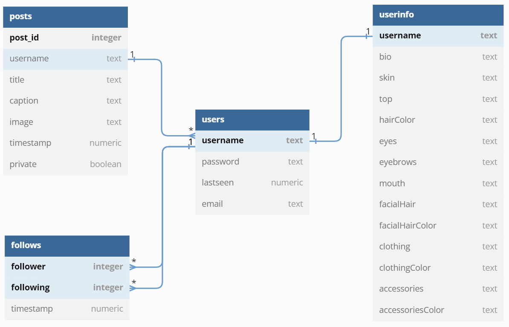
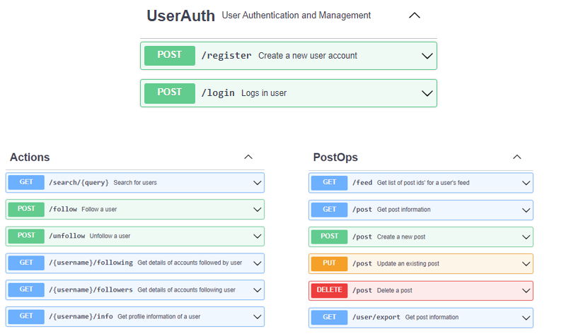

## Description
A simple social media application that offers a real-time multi-user environment for users to document and share their daily-life happenings with their friends. Each user can post pictures with a title and caption, and can follow other users to get a personalized feed.

View the video demonstration [here](https://www.youtube.com/watch?v=qZYJvwUV7nc).
## Technologies Used
- HTML, CSS, Javascript, Vue CLI - Front-end presentation logic and scaffolding (View) 
- Python, Flask - Back-end API declarations for database interactions (Controller) 
- Flask SQLAlchemy - Database Management Module (Model) 
- Flask JWT - Token-based Authentication 
- Celery - Asynchronous workers to offload resource-heavy and timed jobs
- Redis - NoSQL backend used for Celery event management and caching 
- Flask-mail, Jinja2, Weasyprint, Pandas - Jobs requiring user exports, bulk-emails, and time-scheduled actions
## DB Schema Design

Every post has a unique user associated as its creator, A user can follow many other users, and vice versa. The schema also stores data regarding the users’ avatar (display picture) in the userinfo relation. To serve and realise the described context, the above schema has been idealised and implemented.
## API Design

## Architecture and Features
The project has a high-level split into the folders ”flask” and ”vue”, which house the front-end and back-end of the application respectively. 
### Flask back-end
Running the app.py file is enough to fire-up the backend. It aggregates various features such as API declarations, database models, mail clients, cache, celery workers, etc. API classes are declared in different and appropriately named scripts, as designed in the previous section. In a similar fashion, other aforementioned features are also initialized in different files, which are then collectively packed and served on localhost by the main script. The posts folder houses the image files for posts uploaded to the app, and the templates folder consists of jinja2 templates for email generation. 
### Vue front-end
 The default project folder scaffolding provided by the Vue CLI setup is used. Components and Views are stored in the src/components and src/views folder respectively. The public folder consists of the backbone index.html where the entire app is served, and src/App.vue aggregates all views, components and front-end logic into the div with id app.

# Project setup

## Python

```
pip install -r requirements.txt
```

## Vue

```
npm install
```

# Run Project

Host a Redis Server on port 6379. If using a different port, edit config.py accordingly.

From the flask directory:

- Add email-id and password (gmail) for async email functionality in the config.py file.

- Start the celery workers via the following commands (in different terminals):

```
# Celery Beat
celery -A app.celery_app beat --max-interval 1 -l info
```
```
# Celery Workers
celery -A app.celery_app worker -l info -P gevent
```

- Serve the Python-Flask api backend

```
python app.py
```

From the Vue directory:
- Serve the vue frontend

```
npm run serve
```
